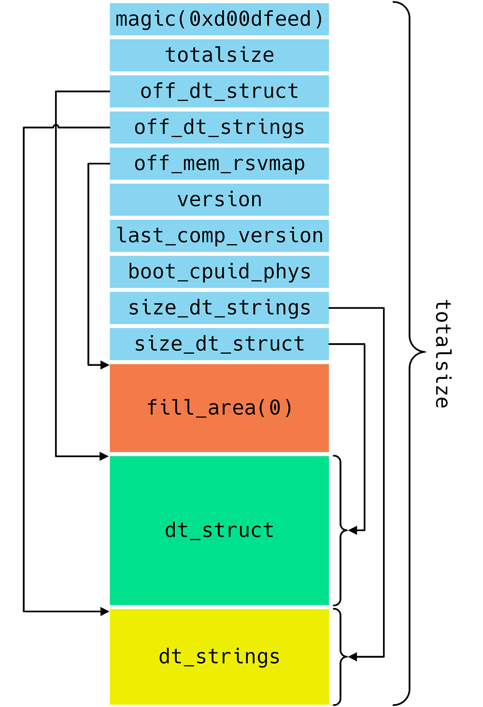
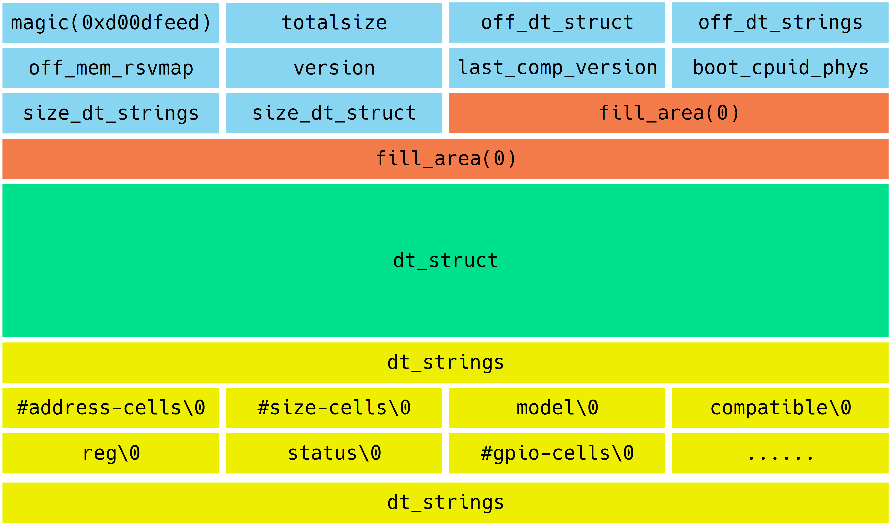
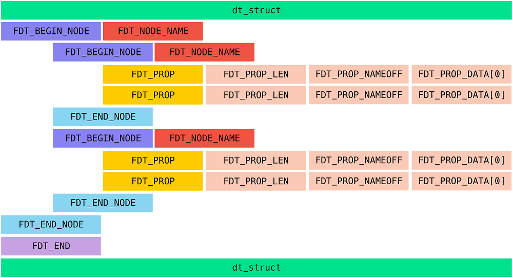
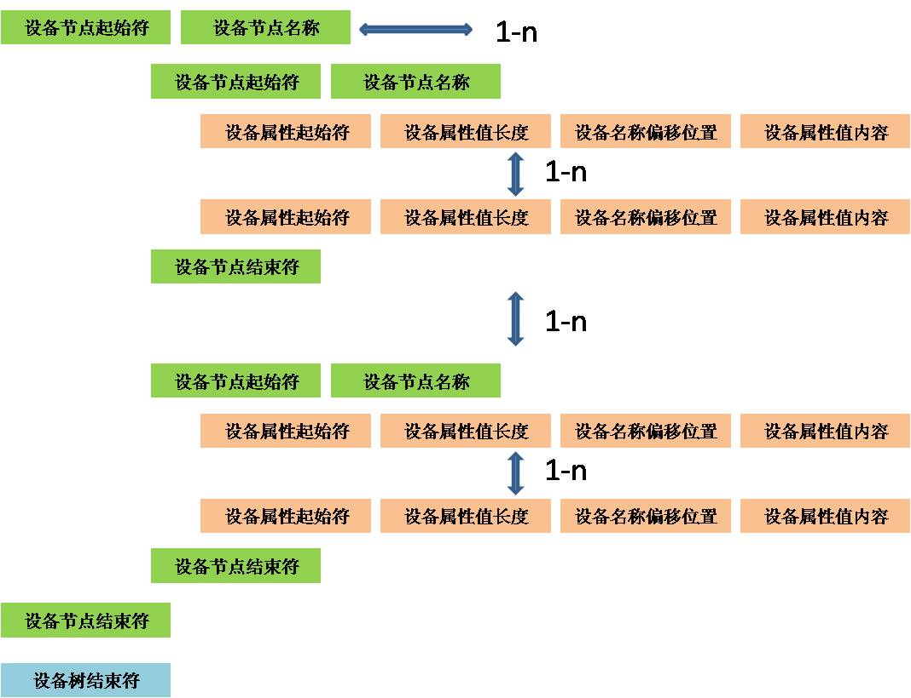

## **第2章-U-boot设备树**
### **1. 基本概念**
**FDT, flatted device tree, **扁平设备树, 简单来说，就是存储部分设备信息结构的文件; U-boot最终会将其编译成dtb文件, 在使用通常中通过解析该dtb文件来获取板级设备的信息
> U-boot的dtb和kernel中的dtb是一致的，有关fdt的详细介绍，参考doc/README.fdt-control

#### **1.1 dtb结构**
Device tree源文件结构分为**header**、**fill_area**、**dt_struct**和**dt_string**四个区域  
> header为头信息；fill_area为填充区域，填充数字0；dt_struct存储节点数值及名称相关信息；dt_string存储属性名




```
// 二进制查看，根据前4个字节magic来验证dtb，注意大端和小端的区别
asb@ubuntu:Iot$ hexdump -C imx6q-sabresd.dtb | more
00000000  d0 0d fe ed 00 00 b5 d4  00 00 00 38 00 00 a9 88  |...........8....|
00000010  00 00 00 28 00 00 00 11  00 00 00 10 00 00 00 00  |...(............|
00000020  00 00 0c 4c 00 00 a9 50  00 00 00 00 00 00 00 00  |...L...P........|
00000030  00 00 00 00 00 00 00 00  00 00 00 01 00 00 00 00  |................|
00000040  00 00 00 03 00 00 00 04  00 00 00 00 00 00 00 01  |................|
```

- **dtb头部存放的是fdt_header的结构体信息**
- **然后是填充区，填充大小为off_dt_struct-sizeof(struct fdt_header)填充值为0**
- **接着就是struct fdt_property结构体的相关信息**
- **最后是dt_string部分**

**Device tree文件结构图**  


**dt_struct在device tree中的结构如下**



#### **1.2 dtb在U-boot中的位置**
dtb能够以两种形式编译到U-boot的镜像中：
- dtb和u-boot的bin文件分离(imx6q中使用的这种方式，在.config文件中可以查看到)
> 通过CONFIG_OF_SEPARATE宏定义使能，dtb最后会追加到u-boot的bin文件的最后面，通过u-boot的结束地址符号_end符号来获取dtb的地址

- dtb集成到u-boot的bin文件内部
> 通过CONFIG_OF_EMBED宏定义使能，dtb会位于u-boot的.dtb.init.rodata段中，通过__dtb_dt_begin符号来获取dtb

-----

### **2. U-boot中支持设备树原理**
**通过配置宏定义CONFIG_OF_CONTROL来使能FDT**

#### **2.1 添加dtb文件的流程**
TBD

### **3. U-boot中获取设备树**
#### **3.1 简介**
在初始化过程中：
> 总控流程在common/board_f.c 文件中


**a) 获取dtb，并且验证其合法性**
```
// 获取dtb地址，验证其合法性: lib/fdtdec.c----fdtdec_setup函数
int fdtdec_setup(void)
{
    gd->fdt_blob = __dtb_dt_begin; // dtb集成到u-boot中，通过__dtb_dt_begin符号表获取dtb地址
    gd->fdt_blob = (ulong *)&_end; // dtb集成到u-boot中，通过_end符号获取dtb地址
    gd->fdt_blob = (void *)getenv_ulong("fdtcontroladdr", 16,
                        (uintptr_t)gd->fdt_blob); // 通过环境变量fdtcontroladdr来指定dtb的地址。

    return fdtdec_prepare_fdt(); // 最终dtb的地址存储在gd->fdt_blob中，在fdtdec_prepare_fdt中检查fdt的合法性
}

int fdtdec_prepare_fdt(void)
{
    // 判断dtb是否存在，是否四个字节对齐，dtb的magic是否正确
    if (!gd->fdt_blob || ((uintptr_t)gd->fdt_blob & 3) ||
        fdt_check_header(gd->fdt_blob)) {
        puts("No valid device tree binary found - please append one to U-Boot binary, use u-boot-dtb.bin or define CONFIG_OF_EMBED. For sandbox, use -d <file.dtb>\n");
        return -1;
    }
    return 0;
}

```

**b) 为dtb分配存储空间，并进行relocate**  
```
// 为dtb分配新的内存地址空间: reserve_fdt
static int reserve_fdt(void)
{
    // 若dtb集成在u-boot中，重定位u-boot过程会把dtb一起relocate, 否则需要单独的relocate
    if (gd->fdt_blob) {
        gd->fdt_size = ALIGN(fdt_totalsize(gd->fdt_blob) + 0x1000, 32); // 获取dtb的size
        gd->start_addr_sp -= gd->fdt_size;
        gd->new_fdt = map_sysmem(gd->start_addr_sp, gd->fdt_size);  // 为dtb分配新的内存空间
        debug("Reser ving %lu Bytes for FDT at: %08lx\n",
              gd->fdt_size, gd->start_addr_sp);
    }
    return 0;
}
```

**c) relocate重定位以后，重新获取dtb的地址**

```
// 重定位dtb: reloc_fdt
static int reloc_fdt(void)
{
    if (gd->flags & GD_FLG_SKIP_RELOC)  // 检查GD_FLG_SKIP_RELOC标识
        return 0;
    if (gd->new_fdt) {
        memcpy(gd->new_fdt, gd->fdt_blob, gd->fdt_size);  // relocate dtb空间
        gd->fdt_blob = gd->new_fdt;  // 切换gd->fdt_blob到dtb新的地址空间
    }
    return 0;
}

```
--------

### **4. U-boot中解析设备树**
**经过以上步骤，gd->fdt_blob已经设置为dtb的地址，fdt提供的接口都是以它作为参数的**

#### **4.1 dtb解析接口**
> 定义在lib/fdtdec.c文件中，节点变量node中存放的是偏移地址

```
// 获得dtb下某个节点的路径path的偏移，偏移就代表这个节点
int fdt_path_offset(const void *fdt, const char *path)
eg：node = fdt_path_offset(gd->fdt_blob, “/aliases”);

// 获得节点node的某个字符串属性值
const void *fdt_getprop(const void *fdt, int nodeoffset, const char *name, int *lenp)
eg： mac = fdt_getprop(gd->fdt_blob, node, “mac-address”, &len);

// 获得节点node的某个整形数组属性值
int fdtdec_get_int_array(const void *blob, int node, const char *prop_name, u32 *array, int count)
eg： ret = fdtdec_get_int_array(blob, node, “interrupts”, cell, ARRAY_SIZE(cell));

// 获得节点node的地址属性值
fdt_addr_t fdtdec_get_addr(const void *blob, int node, const char *prop_name)
eg：fdtdec_get_addr(blob, node, “reg”);

// 获得config节点下的整形属性、bool属性、字符串等等
fdtdec_get_config_int、fdtdec_get_config_bool、fdtdec_get_config_string

// 获得chosen下的name节点的偏移
int fdtdec_get_chosen_node(const void *blob, const char *name)

// 获得chosen下name属性的值
const char *fdtdec_get_chosen_prop(const void *blob, const char *name)
```

> 定义在lib/fdtdec_common.c文件中

```
// 获得节点node的某个整形属性值
int fdtdec_get_int(const void *blob, int node, const char *prop_name, int default_val)
eg： bus->udelay = fdtdec_get_int(blob, node, “i2c-gpio,delay-us”, DEFAULT_UDELAY);

// 获得节点node的某个无符号整形属性值
fdtdec_get_uint
```
