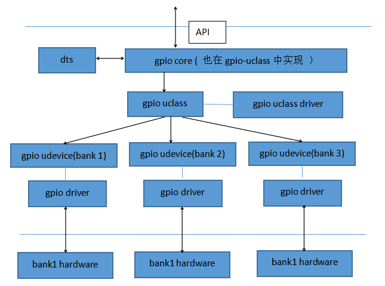

## **第4章实例**
### **1. 实例一: serial驱动**
#### **1.1 定义uclass_driver**
```
// 在serial-uclass.c中定义一个uclass_driver
UCLASS_DRIVER(serial) = {
    .id        = UCLASS_SERIAL, //这里的uclass_id和driver中的uclass_id一致
    .name        = "serial",
    .flags        = DM_UC_FLAG_SEQ_ALIAS,   
    .post_probe    = serial_post_probe,
    .pre_remove    = serial_pre_remove,
    .per_device_auto_alloc_size = sizeof(struct serial_dev_priv),
};
```

#### **1.2 定义serial的dts节点**
```
serial@e2900000 {
        //注意这里的compatible
        compatible = "samsung,exynos4210-uart";
        reg = <0xe2900000 0x100>;
        interrupts = <0 51 0>;
        id = <0>;
};  

```

#### **1.3 定义设备驱动**
```
U_BOOT_DRIVER(serial_s5p) = {
    .name    = "serial_s5p",
    .id    = UCLASS_SERIAL,       // 这里的uclass_id和 uclass_driver中的一致
    .of_match = s5p_serial_ids,   // 设备树种的compatible属性
    .ofdata_to_platdata = s5p_serial_ofdata_to_platdata,
    .platdata_auto_alloc_size = sizeof(struct s5p_serial_platdata),
    .probe = s5p_serial_probe,
    .ops    = &s5p_serial_ops,
    .flags = DM_FLAG_PRE_RELOC,
};

static const struct udevice_id s5p_serial_ids[] = {
    { .compatible = "samsung,exynos4210-uart" },    //注意这里的compatible要和设备树中的一致
    { }
};

```

##### **1.3.1 udevice和对应uclass的创建 **
**dm_scan_fdt**

##### **1.3.2 udevice和对应uclass的绑定 **
**核心解析函数lists_bind_fdt**

##### **1.3.3 对应udevice的probe**
```
int serial_init(void)
{
    // console的serial的初始化
    serial_find_console_or_panic();
    gd->flags |= GD_FLG_SERIAL_READY;
}

static void serial_find_console_or_panic(void)
{

    if (CONFIG_IS_ENABLED(OF_CONTROL) && blob) {

        // 获取指定的serial的dts节点

        // 调用uclass_get_device_by_of_offset，通过dts节点的偏移从uclass的设备链表中获取udevice，并且进行probe。
        if (!uclass_get_device_by_of_offset(UCLASS_SERIAL, node,
                            &dev)) {
            // 将udevice存储在gd->cur_serial_dev，后续uclass中可以直接通过gd->cur_serial_dev获取到对应的设备并且进行操作
            // 但是注意，这种并不是通用做法！！！
            gd->cur_serial_dev = dev;
            return;
        }
    }
}
```
##### **1.3.4 uclass的接口调用**
```
void serial_putc(char ch)
{
    if (gd->cur_serial_dev)
        // 将console对应的serial的udevice作为参数传入
        _serial_putc(gd->cur_serial_dev, ch);
}

static void _serial_putc(struct udevice *dev, char ch)
{
    // 获取设备对应的driver函数的ops操作集
    struct dm_serial_ops *ops = serial_get_ops(dev);
    int err;

    // 以udevice为参数，调用ops中对应的操作函数putc
    do {
        err = ops->putc(dev, ch);
    } while (err == -EAGAIN);
}

```


------
### **2. 实例二: gpio驱动**
#### **2.1 dm-gpio架构**
**gpio的驱动模型架构如图所示：**  


##### **2.1.1 gpio core主要任务是：**   
a) 为上层提供接口  
b) 从dts中获取GPIO属性  
c) 从gpio uclass的设备链表中获取对应udevice设备，并使用其操作集

##### **2.1.2 gpio uclass**
a) 链接属于该uclass的所有udevice   
b) 为udevice的driver提供统一操作集接口

##### **2.1.3 bank和udevice**
a) 在某些平台，把使用同一组寄存器的GPIO构成一个bank，但是不是所有的都有bank的概念，如果每个GPIO都有自己独立的寄存器，则可看成只有一个bank
b) 一个bank对应一个udevice，用bank中的偏移表示具体GPIO号
c) udevice的driver根据bank和offset来操作对应寄存器的bit

#### **2.2 基本原理**
a) 一个bank对应一个udevice，udevice中私有数据中存放着该bank的信息，比如相应寄存器地址等等
b) 上层通过调用gpio core的接口从dtsi获取到GPIO属性对应的gpio_desc描述符，用此描述符描述一个GPIO，它包括该GPIO所属的udevice、在bank内的偏移、以及标志位等
c) 上层使用gpio_desc描述符来作为调用gpio core的操作接口的参数
d) gpio core从gpio_desc描述符提取udevice，并调用其driver中对应的操作集，以bank内的偏移作为其参数（这样driver就能判断出是哪个GPIO了）
e) driver中提取udevice的私有数据中的bank信息，并进行相应的操作
f)

#### **2.2 dm-gpio架构**

##### **2.2.1 架构图**


#### **2.3 dm-gpio架构**

##### **2.3.1 架构图**


#### **2.4 dm-gpio架构**

##### **2.4.1 架构图**


#### **2.5 dm-gpio架构**

##### **2.5.1 架构图**


#### **2.6 dm-gpio架构**

##### **2.6.1 架构图**
driver为uclass提供操作集，其中保存了uclass_id


根据uclass_id查询uclass driver列表获得uclass
udevice会放在两个地方，一个是uclass对应的udevice链表
一个是Device链表中

driver中有compatibile字段，通过检查它和dts节点中的compatible字段是否相同，获取节点名称，获取driver，生成udevice，uclass，并进行绑定

```
// 以serial为例， driver
U_BOOT_DRIVER(serial_s5p) = {
    .name    = "serial_s5p",
    .id    = UCLASS_SERIAL,
    .of_match = s5p_serial_ids,
    .ofdata_to_platdata = s5p_serial_ofdata_to_platdata,
    .platdata_auto_alloc_size = sizeof(struct s5p_serial_platdata),
    .probe = s5p_serial_probe,
    .ops    = &s5p_serial_ops,
    .flags = DM_FLAG_PRE_RELOC,
};

// 以serial-uclass为例，uclass driver
UCLASS_DRIVER(serial) = {
    .id        = UCLASS_SERIAL,
    .name        = "serial",
    .flags        = DM_UC_FLAG_SEQ_ALIAS,   
    .post_probe    = serial_post_probe,
    .pre_remove    = serial_pre_remove,
    .per_device_auto_alloc_size = sizeof(struct serial_dev_priv),
};

```

if(!a): a是假的执行
if(a): a是真的执行
