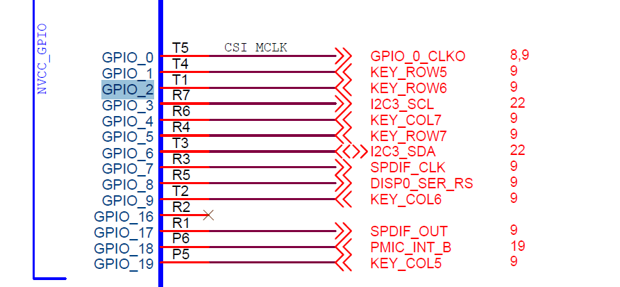

## **第8章-U-boot管脚复用**
> 需要配置寄存器：pad控制器，Mux控制器，select input寄存器和Data寄存器   
配置IOMUX的必备工具：1.芯片原理图；2.芯片软件手册； 3.内核源代码

### **1. 查看原理图**
**找到KEY_ROW6对应的GPIO_2**

### **2. 找到对应的Pad/Group Registers**
**找到GPIO_2对应的控制寄存器 SW_PAD_CTL_PAD_GPIO02**

### **3. 查找芯片手册36章IOMUX相关内容**
**SW_PAD_CTL_PAD_GPIO02寄存器: 控制引脚上拉电阻、下拉电阻和电源控制**  

### **4. 根据ALT5:GPIO1_IO02查找其他相关寄存器**
**Mux控制寄存器：IOMUX_SW_MUX_CTL_PAD_GPIO02**

### **5. GPIO_2的功能ALT5:GPIO1_IO02用于查找其他寄存器**
**Select Input寄存器: IOMUX_KEY_ROW6_SELECT_INPUT**

### **6. 找到对应的Pad/Group Registers**
**找到GPIO_2对应的SW_PAD_CTL_PAD_GPIO02**

### **7. 找到对应的Pad/Group Registers**
**找到GPIO_2对应的控制寄存器SW_PAD_CTL_PAD_GPIO02**

